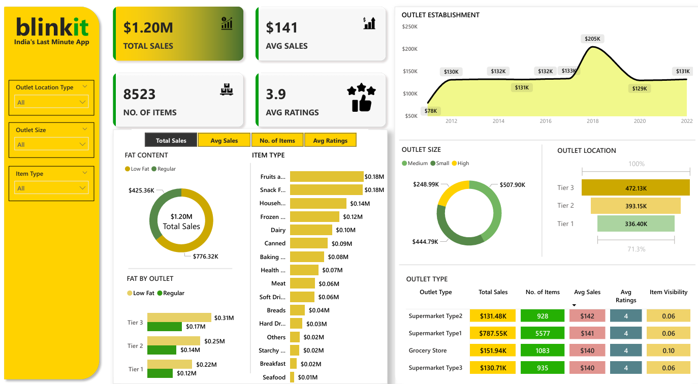

# 📊 Blinkit Sales Dashboard

This repository features an interactive Power BI dashboard created for **Blinkit – India’s Last Minute App**. The dashboard visualizes key sales metrics, outlet performance, and product insights.

## 🚀 Key Features

* **Total Sales Overview**: \$1.2M in total sales, 8.5K+ items, avg sales of \$141, and avg rating of 3.9.
* **Sales by Fat Content**: Breakdown of low fat vs regular product sales.
* **Top Item Categories**: Includes fruits, snacks, household, dairy, etc.
* **Outlet Insights**: Performance by outlet size, type, and tier (Tier 1–3).
* **Trend Analysis**: Sales growth from 2011 to 2022.
* **Ratings & Visibility**: Outlet-wise ratings and item visibility.

## 🛠 Tech Used

* Power BI
* DAX for custom measures
* Interactive visuals & slicers

## 📷 Preview



## 📂 How to Use

1. Clone the repo:

   ```bash
   git clone https://github.com/your-username/blinkit-sales-dashboard.git
   ```
2. Open the `.pbix` file in Power BI Desktop.
3. Explore filters and visuals for insights.

